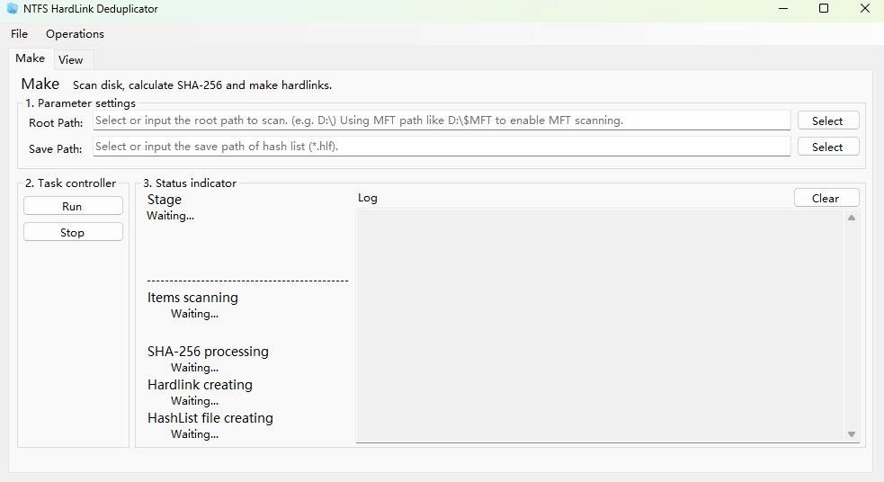

# NTFSHardLinkDedup

  

一款适用于NTFS文件系统的硬链接文件查重工具，在不改变文件夹结构的情况下节省大量磁盘空间。

A hard link file deduplication tool for NTFS file systems, saving a significant amount of disk space without altering the folder structure.

  

***

> [!NOTE]  
> 此项目的大多数代码由ChatGPT编写、后期人工检查合并。

> [!NOTE]  
> Most of the code for this project was written by ChatGPT and then manually reviewed and merged later.

## 功能/Features

- 扫盘/读取文件夹：使用NTFS `$MFT` 原始数据直接解析，**速度极快，** *在一块满的20TB机械硬盘中，15s即可扫完。*

  - 同时兼容普通扫盘和MFT两种模式，MFT需要管理员模式重启。

  - **自动过滤系统文件如$RECYCLE.BIN**以避免出现意外错误。

- 校验和硬链接创建：使用SHA-256完整校验，并以至多1024文件一组创建硬链接。

  - 支持自动保护系统文件（如desktop.ini），自动跳过空文件。

  - 自动修复只读的文件和隐藏的文件。

- HashList保存和搜索

  - 支持以较高性能的搜索显示和列表排序，*实测2 000 000项目全部加载显示仅需2s，且后续无卡顿。*

  - 支持基本AND、OR搜索、完整路径搜索、HASH搜索

  - 支持自动读取已有列表并追加新文件

***

- Disk Scan/Folder Read: Directly parses raw data using NTFS `$MFT`, **extremely fast**. *On a full 20TB hard drive, it only takes 15 seconds to scan.*

  - Compatible with both regular disk scan and MFT modes. MFT requires administrator mode restart.

  - **Automatically filters system files such as $RECYCLE.BIN** to avoid unexpected errors.

- Verification and Hard Link Creation: Uses full SHA-256 verification and creates hard links in groups of up to 1024 files.

  - Supports automatic protection of system files (such as desktop.ini) and automatically skips empty files.

  - Automatically repairs read-only and hidden files.

- HashList Saving and Search

  - Supports high-performance search display and list sorting. *In actual testing, loading and displaying all 2,000,000 items took only 2 seconds, with no subsequent lag.* *

  - Supports basic AND, OR, full path, and HASH searches.

  - Supports automatically reading existing lists and appending new files.

## 注意事项/Notes

- 仅支持NTFS文件系统，其他文件系统尝试启动会输出错误。

- HashList的二次加载：目前不支持校验文件是否一致，故用户需要自行确保前后两次运行的根目录一致，且文件未被修改！

- **建议配合`diskpart`的`readonly`属性设置使用，在处理完毕后进行只读锁，避免文件被改导致HASH失效！**

***

- Only supports NTFS file systems. Attempting to start on other file systems will result in an error.

- Secondary loading of HashList: Currently, file consistency verification is not supported. Therefore, users need to ensure that the root directory is the same for both runs and that the files have not been modified!

- **It is recommended to use this in conjunction with the `diskpart`'s `readonly` property to apply a read-only lock after processing, preventing file modification from invalidating the HASH!**
